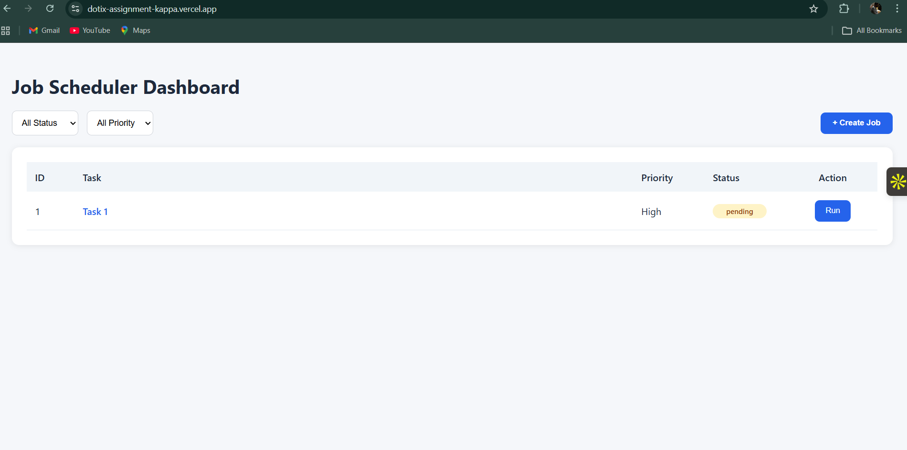
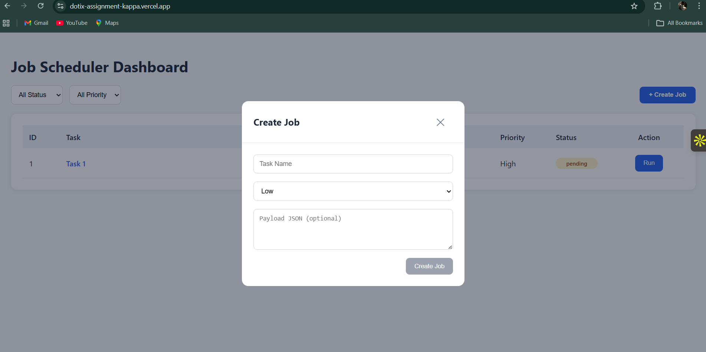
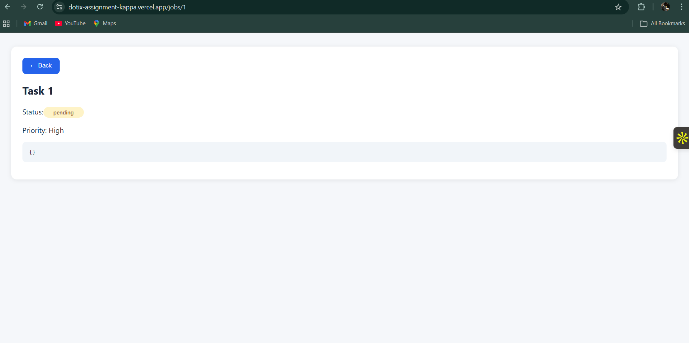

# Job Scheduler & Automation System

A full-stack job scheduling and automation system that allows users to create, manage, and execute background jobs with real-time status tracking and webhook integration.

## Live Demo

#### Frontend (Vercel):  
https://dotix-assignment-kappa.vercel.app/

#### Backend (Render):  
https://dotix-assignment-s0pr.onrender.com

### Data Persistence Note

This project uses SQLite as the database.

When deployed on Render free tier:
- The filesystem is ephemeral
- Data resets when the service restarts
- Previously created jobs may be cleared after inactivity

This behavior is expected for free-tier deployments and does not affect application logic.

For production-grade persistence, a managed database (PostgreSQL / MySQL) or Render persistent disk would be used.


## Tech Stack

### Frontend
- React.js
- Vite
- React Router DOM
- Custom CSS Styling
- Fetch API

### Backend
- Node.js
- Express.js
- SQLite Database

### Deployment
- Frontend: Vercel
- Backend: Render

## Features

### Job Management
- Create background jobs with payload support
- View jobs in dashboard table
- Filter jobs by status and priority
- View detailed job information

### Job Execution
- Manual job trigger
- Background processing simulation
- Status lifecycle tracking:
  - Pending
  - Running
  - Completed

### Automation
- Automatic webhook trigger after job completion

### UI Features
- Modal-based job creation
- Form validation
- Toast notifications (Success & Error)
- Responsive dashboard layout
- Status badges


##  Database Schema (ER / Schema Design)

The application uses a single `jobs` table.

| Column | Type | Description |
|------|------|------------|
| id | INTEGER (PK) | Job identifier |
| taskName | TEXT | Job name |
| payload | JSON/TEXT | Job payload |
| priority | TEXT | Low / Medium / High |
| status | TEXT | pending / running / completed |
| createdAt | TIMESTAMP | Creation time |
| updatedAt | TIMESTAMP | Update time |


## Architecture Explanation

Frontend (React + Vite)  
→ REST API  
Backend (Node.js + Express)  
→ SQLite Database  
→ Job execution  
→ Webhook trigger (webhook.site)

The frontend communicates with the backend via REST APIs.  
The backend manages job lifecycle and triggers webhooks upon completion.


## How To Run Locally

### 1. Clone Repository

```bash
git clone https://github.com/SuryamaheshPenke/dotix-assignment.git
cd dotix-assignment
```

### 2. Backend Setup

```bash
cd backend
npm install
node app.js
```

Backend runs at:  
http://localhost:5000


### 3. Environment Variables Setup

Create a file:

```text
frontend/.env
```

Add:

```env
VITE_API_BASE_URL=http://localhost:5000
```

Restart frontend after setting env variables.

### 4. Frontend Setup

```bash
cd frontend
npm install
npm run dev
```

Frontend runs at:  
http://localhost:5173

## API Documentation

| Method | Endpoint | Description |
|------|---------|-------------|
| GET | `/jobs` | Retrieve all jobs |
| GET | `/jobs/:id` | Retrieve job details |
| POST | `/jobs` | Create a job |
| POST | `/run-job/:id` | Execute job |

## Webhook Flow

1. Job reaches `completed` state
2. Backend sends POST request to webhook URL
3. Payload includes:
   - jobId
   - taskName
   - priority
   - payload
   - completedAt
4. Request and response are logged

## Testing Workflow

1. Create a job  
2. Verify job in dashboard  
3. Run job  
4. Observe status updates  
5. Verify webhook trigger  

## Screenshots

### Dashboard 


### Create Job Modal  


### Job Detail View  


## AI Assistance Disclosure

AI tools were used to assist with learning, debugging, and documentation.

### Tools Used
- ChatGPT (GPT-4.x)

### Areas Assisted
- UI layout and UX decisions
- Job lifecycle design
- Webhook logic explanation
- Deployment debugging
- README structuring

### Example Prompts
1. How to design a mini job scheduler system using React and Express?
2. How should a webhook be triggered after job completion in Node.js?
3. How to structure a full-stack project with frontend and backend folders?
4. How to implement filtering by status and priority in React?
5. Best UX pattern for creating items — modal or inline form?
6. How to validate JSON input in React safely?
7. Why does Vercel show MIME type text/jsx error?
8. How to fix vite command not found in deployment?
9. Best practice for API base URL in Vite?
10. How to configure .env for local vs production?
11. Why frontend still calls localhost after deployment?
12. How to document REST APIs cleanly?

All final implementation decisions were made and validated by the developer.

## 👨‍💻 Author

Surya Mahesh  

GitHub: https://github.com/SuryamaheshPenke
